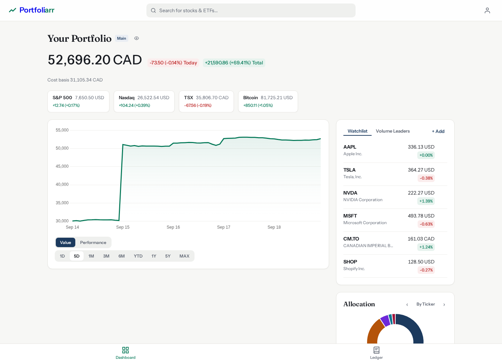
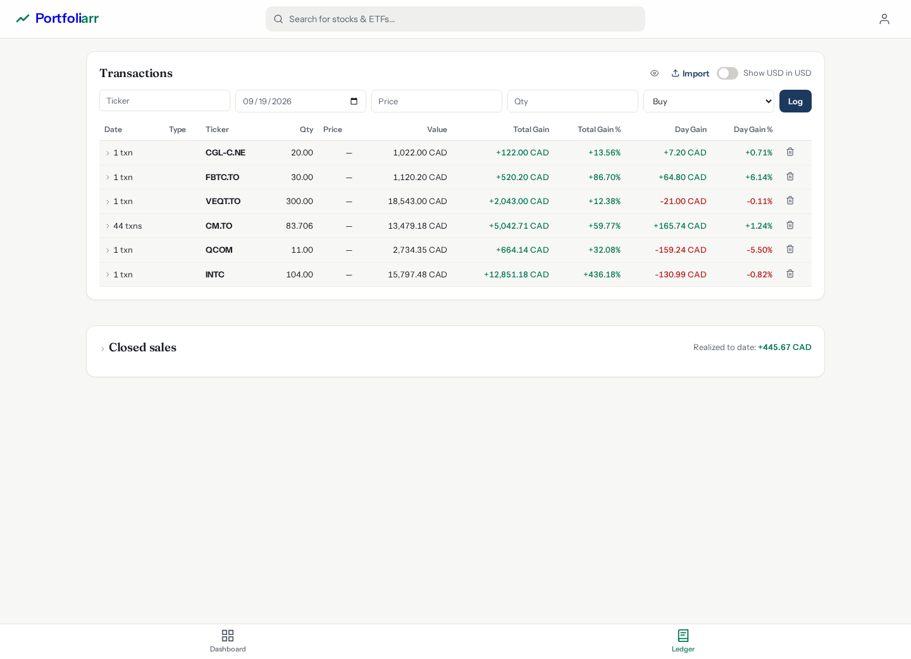
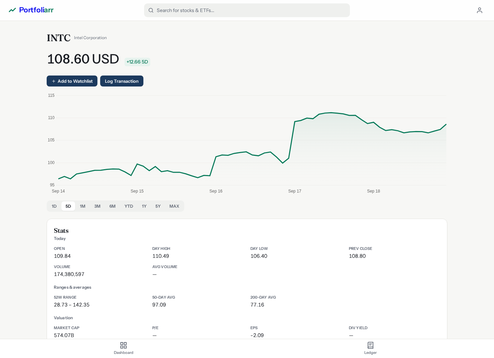
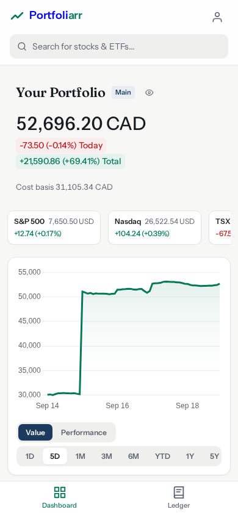

# Portfoliarr

A personal stock and ETF portfolio tracker. Search any ticker Yahoo Finance knows, log buy and sell transactions, and watch your holdings grow — current value, unrealized profit/loss, a portfolio-value-over-time chart, and an allocation breakdown.



Prices and data come from [Yahoo Finance](https://finance.yahoo.com/) through the [yfinance](https://github.com/ranaroussi/yfinance) library. Portfolio views display in Canadian dollars by default; the watchlist and stock pages stay in each security's native currency.

## Pages

- **`/` Dashboard** — value summary strip with cost basis, a grouped transactions table (qty, value, total and day gain per ticker), a portfolio-value chart with a time-weighted Performance view, an allocation donut carousel (by ticker, sector, country, type, cap, currency), index chips, a watchlist, and a ticker search bar.
- **`/ledger` Ledger** — buy/sell transactions with grouping, sorting, editing, and paste import; plus a Closed Sales table showing each sale's realized result in CAD.
- **`/stock/<symbol>` Stock detail** — large current price, time-segmented chart (1D · 5D · 1M · 3M · 6M · YTD · 1Y · 5Y · MAX), basic stats, and buttons to watch or log a transaction.
- **`/preferences` Preferences** — theme (light/dark/system), default ledger sort, and a show-closed-positions toggle. Privacy eye toggles sit on the dashboard and ledger pages.

## More views

| Ledger | Stock detail | Dashboard on mobile |
|---|---|---|
|  |  |  |

## Tech stack

| Layer | Tool |
|---|---|
| Backend | Python 3.14 + [Flask](https://flask.palletsprojects.com/) (serves JSON; the browser renders) |
| Frontend | HTML (Jinja2), vanilla JavaScript, [Chart.js](https://www.chartjs.org/) |
| Database | [SQLite](https://www.sqlite.org/) (lives in the ignored `instance/` folder) |
| Price feed | [yfinance](https://github.com/ranaroussi/yfinance) |

## Quick start (development)

```bash
source .venv/bin/activate          # create it first with python -m venv .venv
pip install -r requirements.txt   # versions are pinned
python app.py                     # dev server on http://localhost:5000
```

Flask serves the UI on port 5000 with the interactive debugger. Confirm it is up: `curl http://localhost:5000/api/indices`.

## Tests

```bash
python -m pytest
```

The suite runs against a fake market and a throwaway database — no network, no real ledger. The first run warms up pandas/numpy and can take ~90 seconds; steady state is ~17 seconds.

## Run with Docker

Only on a server; the dev machine has no Docker. CI publishes `ghcr.io/christopheawad/portfoliarr:latest` on every green push to `main`.

```bash
docker compose pull && docker compose up -d
```

- App URL: `http://localhost:9967`
- The `portfoliarr-data` volume keeps the SQLite ledger across updates
- Server timezone is pinned to `America/Toronto`
- Gunicorn runs one process with eight threads (caches and SQLite require it)

## Android app

`android/` holds a thin WebView client for this web app. Build with `./gradlew assembleDebug` (JDK 17, Android SDK 34). See `android/README.md`.

## Scope

Single user, single portfolio, no login. Not included by design: dividends, cash-balance tracking, multi-user auth, multiple portfolios, currencies beyond USD/CAD, and news/AI/social features.